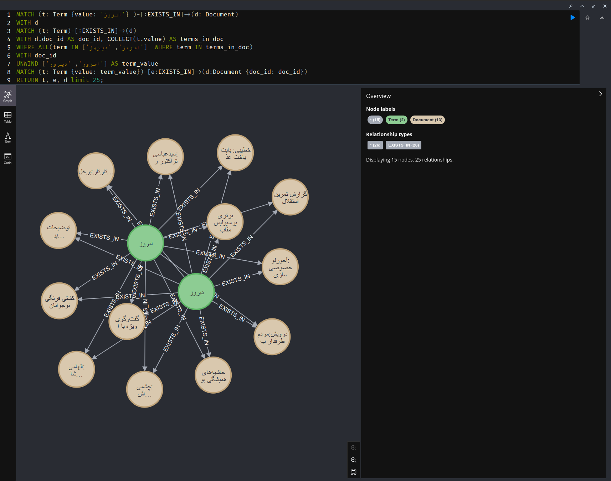
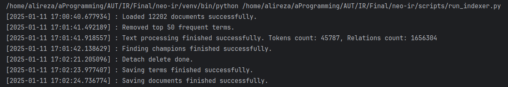
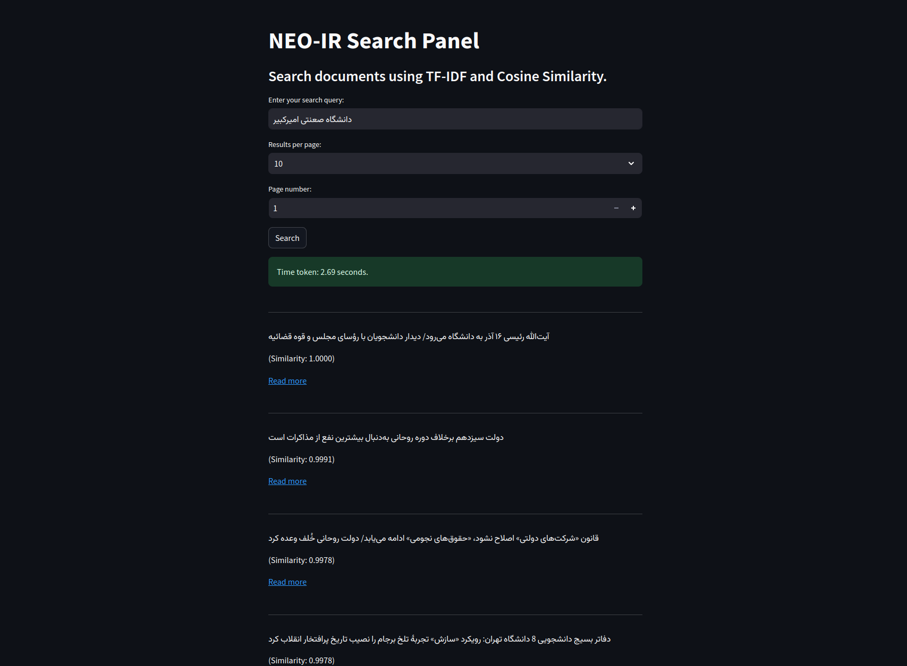

# NEO-IR
Information Retrieval System with Power of Neo4j

---

## Overview
This project implements a search engine using Neo4j as the backend for managing terms and documents. It applies TF-IDF ranking and cosine similarity to retrieve and rank documents based on a user query. The design ensures efficiency, scalability, and modularity.


## Features
1. Document Indexing:
   - Builds a term-document relationship using Neo4j.
   - Stores metadata, including term frequency (TF) and document frequency (DF).
   - Calculates and stores TF-IDF scores for terms.

2. Search Query Processing:
   - Processes user queries to generate query vectors.
   - Retrieves candidate documents based on multiple filter levels.

3. Ranking:
   - Uses cosine similarity to rank documents.


## System Architecture

### Data Model
The Neo4j graph database is designed with the following entities:
+ **Term**
  + value: The term itself (string).
  + document_frequency: Number of documents containing the term (int).
+ **Document**
  + doc_id: Unique identifier (int).
  + title: Document title (string).
  + url: Document URL (string).
+ **EXISTS_IN Relationship**:
  + term_frequency: Frequency of the term in the document.
  + positions: List of positions where the term appears in the document.
  + is_champion: Indicates if the document is a champion for the term.



### Project Structure
+ Infra Layer
  + Includes all the related things to infrastructure like database models and repositories.
+ UseCase Layer
  + Includes all the use cases of the project with 2 main use cases: index and search

## Key Components
- **Text Processor**
  - Tokenize, Normalize and Lemmatize by power of Hazm

- **Indexer**:
  - Extracts terms and their frequencies from documents.
  - Calculates term frequency and document frequency.

-   **Query Processor**:
    - Normalizes and tokenizes user queries.
    - Converts queries into term vectors.

-   **Candidates Retriever**:
    - Retrieves documents using multiple filters:
      1. Documents matching all terms
      2. Champions
      3. High-IDF terms
      4. All documents containing query terms

- **Similarity Calculator**:
    - Computes cosine similarity between the query vector and document vectors.
    - Normalizes both query and document vectors for accuracy.

## Indexing Steps
1. Data Loading:
    - Load raw documents from a JSON file.
2. Removal of Top K Frequent Terms:
    - Identify and remove the top 50 most frequent terms (e.g., stop words) from the index to reduce noise. Available in `removed_top_terms.csv`
3. Text Preprocessing:
    - Tokenize and normalize text.
    - Remove unwanted characters and apply lemmatization.
    - Calculate term and document frequency
4. Champion Lists:
    - Identify top K documents for each term based on TF scores and mark them as champions.
5. Neo4j Indexing
    - Create Term and Document nodes.
    - Establish EXISTS_IN relationships.



## Streamlit panel
Simple panel for searching queries

```bash
streamlit run panel.py
```



## Examples
query: 'امروز'

```json
[
    {
        "doc_id": 9.0,
        "similarity": 1.0,
        "title": "خبر خوب برای استقلال؛ دانشگر با تیم تمرین کرد",
        "url": "https://www.farsnews.ir/news/14001224000819/خبر-خوب-برای-استقلال-دانشگر-با-تیم-تمرین-کرد"
    },
    {
        "doc_id": 9242.0,
        "similarity": 1.0,
        "title": "شـورای هماهنـگی تبـلیـغات اسلامی: ملت ایران همواره وفاداری خود به نظام و انقلاب را به بهترین شیوه‌ها نشان داده است",
        "url": "https://www.farsnews.ir/news/14001009000635/شـورای-هماهنـگی-تبـلیـغات-اسلامی-ملت-ایران-همواره-وفاداری-خود-به-نظام"
    },
    {
        "doc_id": 9257.0,
        "similarity": 1.0,
        "title": "مدیرکل تشکل‌های دانشگاه آزاد: پاسداشت حماسه 9 دی برای همه ضروری و واجب است",
        "url": "https://www.farsnews.ir/news/14001009000312/مدیرکل-تشکل‌های-دانشگاه-آزاد-پاسداشت-حماسه-9-دی-برای-همه-ضروری-و-واجب"
    },
    {
        "doc_id": 9256.0,
        "similarity": 1.0,
        "title": "حماسه 9 دی نشان‌دهنده بصیرت، مسئولیت‌پذیری و بینش عمیق مردم است",
        "url": "https://www.farsnews.ir/news/14001009000356/حماسه-9-دی-نشان‌دهنده-بصیرت-مسئولیت‌پذیری-و-بینش-عمیق-مردم-است"
    },
    {
        "doc_id": 9253.0,
        "similarity": 1.0,
        "title": "برگزاری مراسم ویژه یوم الله ۹ دی در تهران/ نماینده ولی فقیه در سپاه: مردم به فتنه 88 تیر خلاص زدند",
        "url": "https://www.farsnews.ir/news/14001009000453/برگزاری-مراسم-ویژه-یوم-الله-۹-دی-در-تهران-نماینده-ولی-فقیه-در-سپاه-"
    },
    {
        "doc_id": 9251.0,
        "similarity": 1.0,
        "title": "ملت انقلابی ایران در آزمون فتنه 88 مسیر استقلال و عزت خود را پیدا کرد",
        "url": "https://www.farsnews.ir/news/14001009000517/ملت-انقلابی-ایران-در-آزمون-فتنه-مسیر-استقلال-و-عزت-خود-را-پیدا-کرد"
    },
    {
        "doc_id": 9250.0,
        "similarity": 1.0,
        "title": "سخنران مراسم ۹ دی تهران: تاریکی فتنه مردم را از درک واقعیت‌ها غافل نکرد",
        "url": "https://www.farsnews.ir/news/14001009000541/سخنران-مراسم-۹-دی-تهران-تاریکی-فتنه-مردم-را-از-درک-واقعیت‌ها-غافل"
    },
    {
        "doc_id": 9248.0,
        "similarity": 1.0,
        "title": "ناامیدی اجتماعی؛ استراتژی فعلی فتنه گران",
        "url": "https://www.farsnews.ir/news/14001009000586/ناامیدی-اجتماعی-استراتژی-فعلی-فتنه-گران"
    },
    {
        "doc_id": 9247.0,
        "similarity": 1.0,
        "title": "بیانیه جمعیت ایثارگران به مناسبت یوم‌الله 9 دی و دومین سالگرد شهادت شهید سلیمانی",
        "url": "https://www.farsnews.ir/news/14001009000601/بیانیه-جمعیت-ایثارگران-به-مناسبت-یوم‌الله-9-دی-و-دومین-سالگرد-شهادت"
    },
    {
        "doc_id": 9241.0,
        "similarity": 1.0,
        "title": "در سیزدهمین سفر استانی رئیس‌جمهور چه گذشت؟",
        "url": "https://www.farsnews.ir/news/14001009000692/در-سیزدهمین-سفر-استانی-رئیس‌جمهور-چه-گذشت"
    }
]
```

----
query: 'ایران خبر'

```json
[
    {
        "doc_id": 314.0,
        "similarity": 0.7071067811865475,
        "title": "افشاگری نیمار از دعوا با دوناروما در رختکن / ستاره برزیلی «چت واتس‌اپ» منتشر کرد+عکس",
        "url": "https://www.farsnews.ir/news/14001220000139/افشاگری-نیمار-از-دعوا-با-دوناروما-در-رختکن--ستاره-برزیلی-چت-واتس‌اپ"
    },
    {
        "doc_id": 9070.0,
        "similarity": 0.7071067811865475,
        "title": "پیش شرط‌های پابرجایی مکتب سلیمانی در گفت‌وگو با ۲ عضو کمیسیون امنیت ملی/ حاج قاسم از دست چه کسانی خون دل خورد؟",
        "url": "https://www.farsnews.ir/news/14001008000231/پیش-شرط‌های-پابرجایی-مکتب-سلیمانی-در-گفت‌وگو-با-۲-عضو-کمیسیون-امنیت"
    },
    {
        "doc_id": 5291.0,
        "similarity": 0.7071067811865475,
        "title": "با اعلام AFC: استقلال و پرسپولیس از لیگ قهرمانان حذف شدند",
        "url": "https://www.farsnews.ir/news/14001017000056/با-اعلام-AFC-استقلال-و-پرسپولیس-از-لیگ-قهرمانان-حذف-شدند"
    },
    {
        "doc_id": 5323.0,
        "similarity": 0.7071067811865475,
        "title": "مدافع بارسلونا گزینه سعودی‌ها برای تقویت خط دفاع نیوکاسل",
        "url": "https://www.farsnews.ir/news/14001016000146/مدافع-بارسلونا-گزینه-سعودی‌ها-برای-تقویت-خط-دفاع-نیوکاسل"
    },
    {
        "doc_id": 5330.0,
        "similarity": 0.7071067811865475,
        "title": "از تکذیب توافق آزمون با لیون تا خوشحالی روس‌ها+عکس",
        "url": "https://www.farsnews.ir/news/14001016000067/از-تکذیب-توافق-آزمون-با-لیون-تا-خوشحالی-روس‌ها-عکس"
    },
    {
        "doc_id": 5552.0,
        "similarity": 0.7071067811865475,
        "title": "واکنش تند باشگاه پدیده به شایعه قمه کشی در تمرین",
        "url": "https://www.farsnews.ir/news/14001012000953/واکنش-تند-باشگاه-پدیده-به-شایعه-قمه-کشی-در-تمرین"
    },
    {
        "doc_id": 5729.0,
        "similarity": 0.7071067811865475,
        "title": "سجادی:  از دبیرکل AFC خواستم از کنار سرخابی ها آسان نگذرد/با صدری و هیات مدیره کار پرسپولیس را جلو می‌بریم",
        "url": "https://www.farsnews.ir/news/14001010000289/سجادی--از-دبیرکل-AFC-خواستم-از-کنار-سرخابی-ها-آسان-نگذرد-با-صدری-و"
    },
    {
        "doc_id": 6316.0,
        "similarity": 0.7071067811865475,
        "title": "عنایتی: با شرایط ویژه مقابل تراکتور بازی می کنیم/شکست در ماهشهر برای ما شگفتی نبود",
        "url": "https://www.farsnews.ir/news/14001002000341/عنایتی-با-شرایط-ویژه-مقابل-تراکتور-بازی-می-کنیم-شکست-در-ماهشهر-برای"
    },
    {
        "doc_id": 7347.0,
        "similarity": 0.7071067811865475,
        "title": "دستاورد سفرهای خارجی رئیسی و غفلت 8 ساله روحانی از همسایگان",
        "url": "https://www.farsnews.ir/news/14001208000502/دستاورد-سفرهای-خارجی-رئیسی-و-غفلت-ساله-روحانی-از-همسایگان"
    },
    {
        "doc_id": 8179.0,
        "similarity": 0.7071067811865475,
        "title": "تشریح برنامه‌های دهه فجر/ رعایت پروتکل‌ها را در برگزاری راهپیمایی 22 بهمن اصل می‌دانیم",
        "url": "https://www.farsnews.ir/news/14001111000236/تشریح-برنامه‌های-دهه-فجر-رعایت-پروتکل‌ها-را-در-برگزاری-راهپیمایی-22"
    }
]
```

----

query: 'کمیسیون'

```json
[
    {
        "doc_id": 13.0,
        "similarity": 1.0,
        "title": "پولادگر: درخشش‌های هندبال مایه آبرو و اعتبار بین‌المللی است/ پاکدل: زودتر از برنامه به اهداف خود رسیدیم",
        "url": "https://www.farsnews.ir/news/14001224000731/پولادگر-درخشش‌های-هندبال-مایه-آبرو-و-اعتبار-بین‌المللی-است-پاکدل-"
    },
    {
        "doc_id": 10611.0,
        "similarity": 1.0,
        "title": "نایب رئیس کمیسیون اجتماعی مجلس: تلاش صهیونیست‌ها و جیره‌خوارانش علیه ورزش ایران بی‌نتیجه می‌ماند",
        "url": "https://www.farsnews.ir/news/14000829000327/نایب-رئیس-کمیسیون-اجتماعی-مجلس-تلاش-صهیونیست‌ها-و-جیره‌خوارانش-علیه"
    },
    {
        "doc_id": 10498.0,
        "similarity": 1.0,
        "title": "الزام «اینماد» برای کسب و کارها مشکلات بسیاری برایشان ایجاد کرده است",
        "url": "https://www.farsnews.ir/news/14000908000193/الزام-اینماد-برای-کسب-و-کارها-مشکلات-بسیاری-برایشان-ایجاد-کرده-است"
    },
    {
        "doc_id": 10496.0,
        "similarity": 1.0,
        "title": "مخالفان افزایش ظرفیت پزشکی به جای فشار و لابی سیاسی، استدلال کارشناسی ارائه دهند",
        "url": "https://www.farsnews.ir/news/14000908000261/مخالفان-افزایش-ظرفیت-پزشکی-به-جای-فشار-و-لابی-سیاسی-استدلال-کارشناسی"
    },
    {
        "doc_id": 10495.0,
        "similarity": 1.0,
        "title": "حمایت از مردم مسلمان جهان وظیفه مهم جمهوری اسلامی است",
        "url": "https://www.farsnews.ir/news/14000908000240/حمایت-از-مردم-مسلمان-جهان-وظیفه-مهم-جمهوری-اسلامی-است"
    },
    {
        "doc_id": 10491.0,
        "similarity": 1.0,
        "title": "هتل کوبورگ زیر ذره‌بین بهارستان/ تاکید وکلای ملت بر «انتفاع اقتصادی ایران» از مذاکرات",
        "url": "https://www.farsnews.ir/news/14000908000357/هتل-کوبورگ-زیر-ذره‌بین-بهارستان-تاکید-وکلای-ملت-بر-انتفاع-اقتصادی"
    },
    {
        "doc_id": 10486.0,
        "similarity": 1.0,
        "title": "کمیسیون اصل 90 همه دستگاه‌های مسئول را پای کار ساماندهی ناهنجاری‌های اخلاقی و فرهنگی می‌آورد",
        "url": "https://www.farsnews.ir/news/14000908000547/کمیسیون-اصل-90-همه-دستگاه‌های-مسئول-را-پای-کار-ساماندهی-ناهنجاری‌های"
    },
    {
        "doc_id": 10485.0,
        "similarity": 1.0,
        "title": "80 میلیون دلار به بهانه واردات لاستیک از آستان قدس رضوی کلاهبرداری کرده‌اند",
        "url": "https://www.farsnews.ir/news/14000908000326/0-میلیون-دلار-به-بهانه-واردات-لاستیک-از-آستان-قدس-رضوی-کلاهبرداری"
    },
    {
        "doc_id": 10472.0,
        "similarity": 1.0,
        "title": "آمریکا فکر نکند که با آشوب چند نفر می‌تواند برگ برنده در مذاکرات داشته باشد",
        "url": "https://www.farsnews.ir/news/14000907000798/آمریکا-فکر-نکند-که-با-آشوب-چند-نفر-می‌تواند-برگ-برنده-در-مذاکرات-داشته"
    },
    {
        "doc_id": 10471.0,
        "similarity": 1.0,
        "title": "دو نشست جداگانه کارشناسان و مسئولان برای اصلاح بازار خودرو",
        "url": "https://www.farsnews.ir/news/14000908000828/دو-نشست-جداگانه-کارشناسان-و-مسئولان-برای-اصلاح-بازار-خودرو"
    }
]
```

---
query: 'کریسمس کمیسیون'

```json
[
    {
        "doc_id": 5431.0,
        "similarity": 0.7071067811865475,
        "title": "وقتی زیدان به رئال مادرید بازگشت+افتخارات",
        "url": "https://www.farsnews.ir/news/14001014000983/وقتی-زیدان-به-رئال-مادرید-بازگشت-افتخارات"
    },
    {
        "doc_id": 9427.0,
        "similarity": 0.7071067811865475,
        "title": "ترکیب نهایی کمیسیون تلفیق بودجه 1401 مشخص شد",
        "url": "https://www.farsnews.ir/news/14001005000609/ترکیب-نهایی-کمیسیون-تلفیق-بودجه-40-مشخص-شد"
    },
    {
        "doc_id": 9490.0,
        "similarity": 0.7071067811865475,
        "title": "فارس من| سرانجام طرح «بسیج سازندگی»/ ذوالنوری: جان‌باختگان اردوهای جهادی «شهید خدمت» محسوب خواهند شد",
        "url": "https://www.farsnews.ir/news/14001004000196/فارس-من|-سرانجام-طرح-بسیج-سازندگی-ذوالنوری-جان‌باختگان-اردوهای-جهادی"
    },
    {
        "doc_id": 9498.0,
        "similarity": 0.7071067811865475,
        "title": "انتخاب 45 عضو کمیسیون تلفیق بودجه 1401 در هفته جاری",
        "url": "https://www.farsnews.ir/news/14001004000218/انتخاب-45-عضو-کمیسیون-تلفیق-بودجه-40-در-هفته-جاری"
    },
    {
        "doc_id": 9500.0,
        "similarity": 0.7071067811865475,
        "title": "دستور کار صحن مجلس/ پاسخگویی اولین وزیر دولت جدید به نمایندگان و بررسی 6 تفحص",
        "url": "https://www.farsnews.ir/news/14001004000107/دستور-کار-صحن-مجلس-پاسخگویی-اولین-وزیر-دولت-جدید-به-نمایندگان-و-بررسی"
    },
    {
        "doc_id": 9506.0,
        "similarity": 0.7071067811865475,
        "title": "عضو هیات رئیسه مجلس: 25 هزار نیروی مازاد با توصیه در خودروسازی‌ها جمع شده‌اند/ ماجرای انتقال پرونده بازنشستگی روحانی",
        "url": "https://www.farsnews.ir/news/14001003000368/عضو-هیات-رئیسه-مجلس-25-هزار-نیروی-مازاد-با-توصیه-در-خودروسازی‌ها-جمع"
    },
    {
        "doc_id": 9854.0,
        "similarity": 0.7071067811865475,
        "title": "مخالفت کمیسیون آیین نامه با تغییر ترکیب کمیسیون قضایی مجلس",
        "url": "https://www.farsnews.ir/news/14000923000130/مخالفت-کمیسیون-آیین-نامه-با-تغییر-ترکیب-کمیسیون-قضایی-مجلس"
    },
    {
        "doc_id": 9970.0,
        "similarity": 0.7071067811865475,
        "title": "70 هزار کلاس بدون معلم/ نیاز 200 هزار میلیاردی برای سنددار کردن اموال آموزش و پرورش",
        "url": "https://www.farsnews.ir/news/14000915000506/0-هزار-کلاس-بدون-معلم-نیاز-200-هزار-میلیاردی-برای-سنددار-کردن-اموال"
    },
    {
        "doc_id": 10013.0,
        "similarity": 0.7071067811865475,
        "title": "دستور کار کمیسیون‌های مجلس/ بررسی تحقیق و تفحص از شرکت ملی مس ایران",
        "url": "https://www.farsnews.ir/news/14000918000504/دستور-کار-کمیسیون‌های-مجلس-بررسی-تحقیق-و-تفحص-از-شرکت-ملی-مس-ایران"
    },
    {
        "doc_id": 10037.0,
        "similarity": 0.7071067811865475,
        "title": "جزئیات آخرین نسخه طرح حمایت از حقوق کاربران فضای مجازی",
        "url": "https://www.farsnews.ir/news/14000917000569/جزئیات-آخرین-نسخه-طرح-حمایت-از-حقوق-کاربران-فضای-مجازی"
    }
]
```
